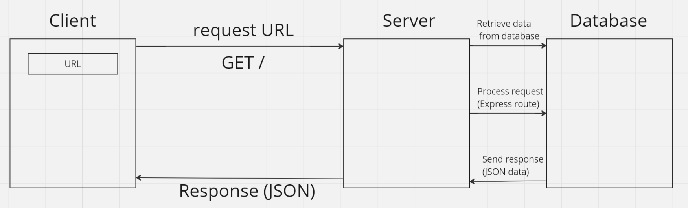

# Movies Library App - v1.0.0

**Author Name**: [Moayad Hamdan]

## WRRC

## Overview
This project is a movie library app that allows users to browse the latest movies based on categories.

## Getting Started
To build and run this app on your own machine, follow these steps:

1. Clone this repository to your local machine:

    git clone https://github.com/your-username/Movies-Library.git

2. Navigate to the project directory:

    cd Movies-Library

3. Install the required dependencies:

    npm install

4. Start the server:

    npm start

5. Open your web browser and go to the following address:

    http://localhost:3000/
    
6. You should now see the home page of the Movies Library app.

## Project Features
- Home Page Endpoint: `/`
- Displays the latest movies with details.
- Favorite Page Endpoint: `/favorite`
- Displays a welcome message for the favorite page.
- Error Handling:
- Handles server errors (status 500) and page not found errors (status 404).